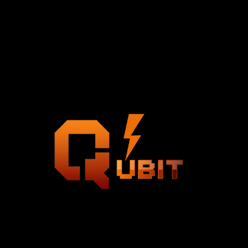

<p align="center">
  
</p>

<h1 align="center">⚡ Qubit – AI Browser</h1>

<p align="center">
  <b>AI-powered real-time browser automation tool</b><br>
  Control and interact with the web using natural language commands.
</p>

---

## 🌟 Features

- 🧠 **AI-Powered Commands** – Control your browser using plain English (e.g., “Open YouTube and search lo-fi music”).  
- ⚙️ **Real-Time Browser Control** – Watch your browser respond instantly via WebSocket.  
- 🌐 **Multi-Session Support** – Manage multiple browsers at once.  
- ⚡ **FastAPI + Playwright Backend** – Super fast, reliable, and modern.  
- 💻 **Clean UI** – Simple web interface built with HTML, CSS, and JS.

---

## 🛠️ Tech Stack

| Layer | Technologies |
|:------|:--------------|
| **Frontend** | HTML, CSS, JavaScript |
| **Backend** | FastAPI (Python) |
| **Browser Engine** | Playwright |
| **Communication** | WebSocket |
| **AI Layer (optional)** | Gemini API / OpenAI API |
| **Hosting (optional)** | Vercel / Render / Localhost |

---

## 📸 Screenshots

| Interface | Description |
|:-----------|:-------------|
|  | Main interface showing live browser feed |
|  | Example of a natural language command execution |
|  | Multi-session browser control interface |

> 📝 Add your screenshots inside the `/screenshots` folder.

---

## 🎥 Demo Video

🎬 [Watch Demo Video](videos/demo.mp4)

> Upload your screen recording to `/videos/demo.mp4` or paste a YouTube link here.

---

## 🚀 Installation Guide

### 1️⃣ Clone the repository
```bash
git clone https://github.com/yourusername/Qubit.git
cd Qubit
```

### 2️⃣ Create and activate environment (uv)
```bash
uv venv --python 3.11
source .venv/bin/activate
uv sync
```

Alternatively, with pip:
```bash
python -m venv venv
source venv/bin/activate   # On Windows: venv\Scripts\activate
pip install -r requirements.txt
```

### 3️⃣ Install Playwright browsers
```bash
playwright install
```

### 4️⃣ Run the server
```bash
uvicorn main:app --reload
```

### 5️⃣ Open the interface
Visit:

```bash
http://localhost:8000/static/index.html
```

Then click "Start Session", type a command, and press "Execute Task" ⚡

---

## 🔌 API Endpoints

| Method | Endpoint | Description |
|:------:|:--------:|:------------|
| GET | `/` | Health check endpoint |
| POST | `/start-session` | Start a new browser session |
| WS | `/ws/{session_id}` | WebSocket endpoint for real-time communication |

---

## 💡 Future Enhancements

- 🤖 Integrate Gemini or ChatGPT for complex understanding  
- 🔒 Add authentication for secure sessions  
- 📊 Implement analytics for browser usage  
- 🧠 Add AI memory for smarter browsing

---

## 📜 License

MIT © 2025 Mohammad Harun  
https://github.com/yourusername/Qubit

---

## 💬 About the Developer

Developed by Mohammad Harun  
Building intelligent, future-focused AI software with modern tech stacks.

- 🌐 Portfolio: https://portfolio-harun.vercel.app  
- 📧 Email: your@email.com

---

### 📁 Folder setup to make it work

```text
Qubit/
├── assets/
│   └── logo.png            ← your logo image here
├── screenshots/
│   ├── dashboard.png
│   ├── command.png
│   └── session.png
├── videos/
│   └── demo.mp4
├── main.py
├── requirements.txt
└── README.md
```

---

## ✅ Steps before push
1. Save your logo image as `assets/logo.png`.  
2. Add screenshots and demo video in the folders above.  
3. Replace `yourusername` and your email in this README.  
4. Push to GitHub:

```bash
git add .
git commit -m "Update README with branding and visuals"
git push
```